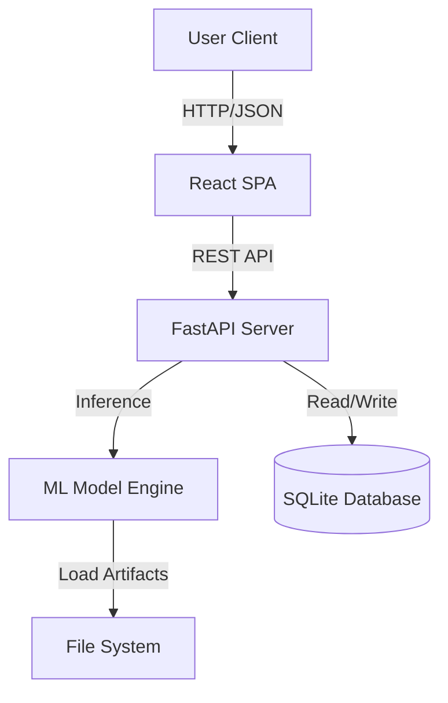

# Sentiment Analyzer Application

A full-stack machine learning application that performs real-time sentiment analysis on user text. The system uses a React frontend for interaction and a FastAPI backend with a Scikit-learn Logistic Regression model for inference.

---

## 🏗️ High-Level Design (HLD)

### System Architecture
The system follows a standard Client-Server architecture with a persistent database layer.



### Component Overview
1.  **Frontend (UI Layer)**
    *   **Technology**: React 18, Vite, TailwindCSS.
    *   **Responsibility**: Renders the UI, captures user input, displays visualizations (charts/graphs), and manages application state.
    *   **Communication**: Sends asynchronous HTTP requests (Axios) to the backend.

2.  **Backend (Service Layer)**
    *   **Technology**: Python 3.9+, FastAPI, Uvicorn.
    *   **Responsibility**: Exposes REST endpoints, validates requests, orchestrates model inference, and handles database transactions.
    *   **Scalability**: Stateless design allows for horizontal scaling (though currently running as a single local instance).

3.  **ML Engine (Inference Layer)**
    *   **Technology**: Scikit-learn, Joblib, Pandas.
    *   **Components**:
        *   `TfidfVectorizer`: Converts raw text into numerical feature vectors.
        *   `LogisticRegression`: Binary classifier for sentiment prediction.
    *   **Data Flow**: Raw Text $\to$ Preprocessing $\to$ Vectorization $\to$ Probability Score $\to$ Classification.

4.  **Data Layer**
    *   **Technology**: SQLite.
    *   **Responsibility**: Stores persistent history of all analyses performed.

---

## 🔧 Low-Level Design (LLD)

### 1. Directory Structure
```
/
├── backend/                  # Python/FastAPI Server
│   ├── app.py               # Application Entry Point & Route Handlers
│   ├── database.py          # Database Connection & Initialization
│   ├── generate_data.py     # Synthetic Data Generator
│   ├── model_train.py       # Model Training Script
│   ├── sentiment.ipynb      # Colab Notebook for Experimentation
│   ├── sentiment_v1.pkl     # Serialized Model Artifact
│   └── vectorizer_v1.pkl    # Serialized Vectorizer Artifact
│
└── sentiment-frontend/       # React Client
    ├── src/
    │   ├── components/      # UI Modules
    │   │   ├── AnalysisInput.jsx    # Form Handling
    │   │   ├── HistoryList.jsx      # List View
    │   │   ├── ResultsDisplay.jsx   # Result Card
    │   │   └── StatsDashboard.jsx   # KPI Cards
    │   └── App.jsx          # Main Controller View
```

### 2. API Specifications

#### `POST /api/predict`
Analyzes text and returns sentiment scores.
*   **Request**:
    ```json
    { "text": "I love this product!" }
    ```
*   **Response**:
    ```json
    {
      "sentiment": "positive",
      "confidence": 0.95,
      "positive_score": 0.95,
      "negative_score": 0.05,
      "timestamp": "2025-12-24T10:00:00"
    }
    ```

#### `GET /api/stats`
Retrieves aggregated statistics and recent history.
*   **Response**:
    ```json
    {
      "total_predictions": 150,
      "sentiment_distribution": { "positive": 100, "negative": 50 },
      "recent_predictions": [ ... ]
    }
    ```

### 3. Database Schema
**Table**: `predictions`
| Column | Type | Description |
|--------|------|-------------|
| `id` | INTEGER PK | Auto-incrementing primary key |
| `text` | TEXT | User input text |
| `sentiment` | TEXT | 'positive' or 'negative' |
| `confidence` | REAL | Max probability score (0.0 - 1.0) |
| `positive_score` | REAL | Probability of positive class |
| `negative_score` | REAL | Probability of negative class |
| `timestamp` | TEXT | ISO 8601 timestamp |

### 4. ML Pipeline Details
*   **Preprocessing**: Text is lowercased (implicit in TF-IDF).
*   **Vectorization**: `TfidfVectorizer` with `max_features=5000` and `stop_words='english'`.
*   **Model**: Logistic Regression with `liblinear` solver.
*   **Performance**: Trained on balanced synthetic dataset (50/50 positive/negative).

---

## 🚀 Quick Start
1.  **Backend**:
    ```bash
    cd backend
    python -m uvicorn app:app --reload --port 8000
    ```
2.  **Frontend**:
    ```bash
    cd sentiment-frontend
    npm run dev
    ```
